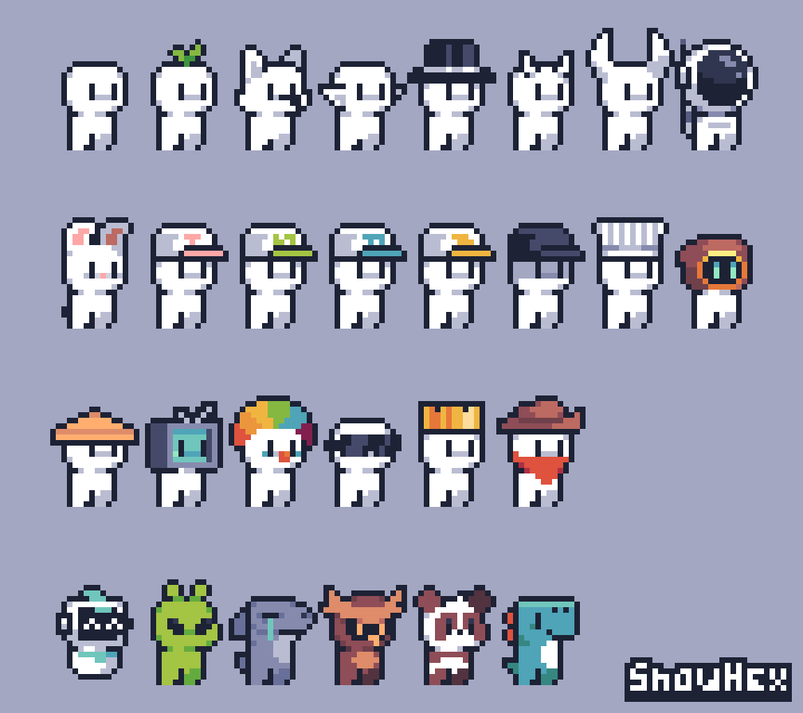

# ℹ️ What is Get Lost?

**For gamers**, Get Lost is a single player desktop and mobile web game. Players are dropped into a random level where they explore new environments, make decisions, and have interactions. Items that they acquire and decisions that they make persist and can affect other levels. Each time they play, new levels will be available, authored by new artists, so that their experience is always changing.

**For creators**, Get Lost is a platform to publish self-contained experiences and collaborate with other artists around the world. We give creators a [development environment](./reference/starting-dev-env.md) with everything they need to create a level. Creators can publish their levels to the game just by pushing the changes from their devenv to Github. Each level can query decisions that the player has made in other levels to provide a rich narrative experience for the player.

## ✨ The vision

Get Lost aims to connect game designers using collaborative game development, to create a rich, continually-evolving experience for casual gamers.

## ✅ What it is

- A premade framework for creating levels in a larger game narrative
- A platform for artists to tell stories without needing to create a whole game
- A place for artists to collaborate together to create a larger experience
- A dynamic story that grows and changes based on the contributions from individual levels
- An evolving multiverse with levels changing and appearing all the time

## ❌ What it is not

- A game-maker
- A static game with set levels
- A pre-defined story or narrative
- A collection of separate mini-games
- A crypto or NFT project
- A place for [AI slop](https://en.wikipedia.org/wiki/AI_slop)

## The pieces

### 🧩 The platform

The platform is what lets creators publish their level into the Get Lost game so that people on the internet can play it. Once a level has been published, it will be connected to the Get Lost game so that players can visit it as part of their journey. You, as a creator, can continue to tweak the content and evolve the level however you see fit, and your changes will be visible to the players in the game. As you think up new storylines, or create new items, you can add them to your level to enrich the player experience.

### 🎮 The game

The game is the player's cohesive experience through the Get Lost levels. Every level published by an artist is stitched into Get Lost by connecting it with other levels. And because all levels must have at least 1 entrypoint and at least 2 exits, there will always be more places to visit&mdash;no dead ends.

There is only one player avatar (1) that moves through levels, and players can make choices in levels that affect their traits. For example, if a player steals money from an NPC, the level may decrease their "trustworthiness" trait. Other levels can check this trait and give players different experiences.
{ .annotate }

Items are another way for artists to collaborate across levels. Items that are picked up in one level can be used in other levels. For example, if a fire level gives a player a magic fire wand, and later they find themselves in an ice level, they might be able to melt a frozen door with it.

1. One player avatar, but several possible variations. 

### ⚙️ The engine

The Get Lost engine provides all of the fundamental gameplay features like physics, sounds, controls, item inventory, tileset loading, etc... everything to make the level development and game experience run smoothly. As a creator, your interaction with the engine will be through the [Assemblyscript](https://www.assemblyscript.org/) code that you will write for your level. For example, to play a sound, or to start a dialogue with an NPC. Other than that, the engine is mostly hidden from you.
