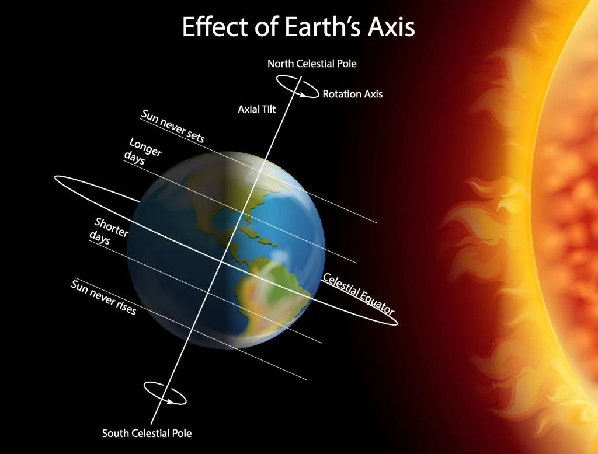
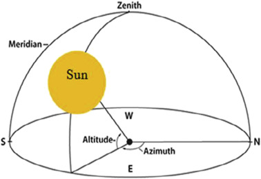
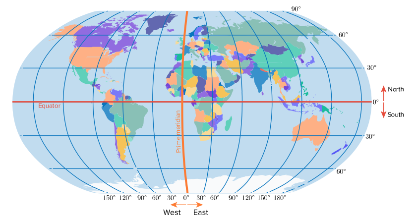
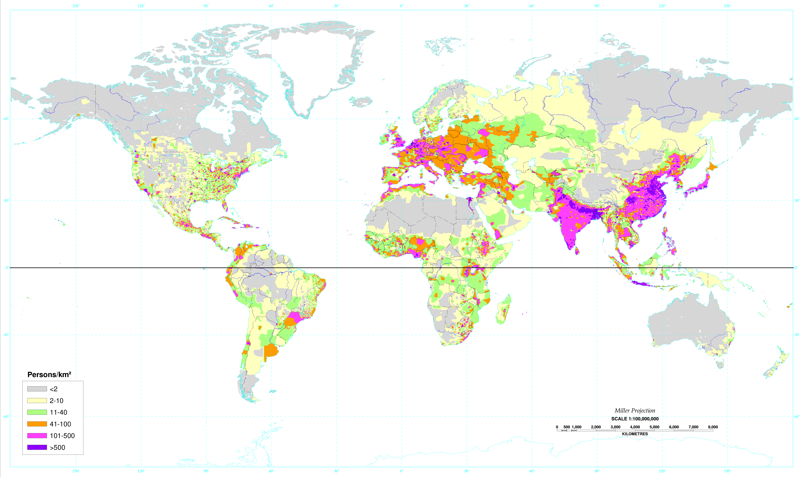
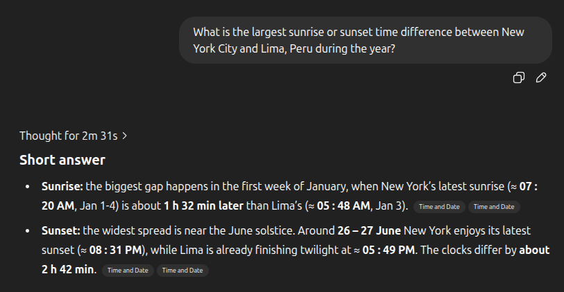

# :sunrise: Guessing the player's sunrise

The Get Lost engine aims to be an expressive storytelling platform within the domain of 2.5D pixel games. One way the engine supports this goal is by giving level designers an automatic day and night cycle that is synced with the player's physical location in the real world.


[Play this level :material-gamepad:](https://getlost.gg/994021540/main){ .md-button }

This makes a player's experience more immersive; if they play at night, the level is at night, changing the vibe and potentially changing the player's interactions. The engine does this by re-shading the art assets in real time with WebGL. To do this re-shading, it needs two things:

1. A rough physical location of the player.
1. The current datetime of the player.

From these, we can derive the sun's position using the incredible [suncalc](https://www.npmjs.com/package/suncalc) library by [Volodymyr Agafonkin](https://agafonkin.com/). It does all of the heavy lifting involved with determining an accurate sun position:

<figure markdown="span">

  <figcaption>The sunrise and sunset times can be drastically different depending on location and date.</figcaption>
</figure>

For a given latitude, longitude, and datetime, `suncalc` returns the sun's altitude and azimuth. From this, we can derive colors to blend with the art assets in the game.

<figure markdown="span">

  <figcaption>Altitude can be used for sky color, azimuth for light direction.</figcaption>
</figure>

This tackles the sun position, but how do we get the player's location in the first place?

## 📍 Acquiring the player's location

Originally, I was going to use the [Geolocation Web API](https://developer.mozilla.org/en-US/docs/Web/API/Geolocation_API), which gives fine-grained location coordinates. However, while ideal from an accuracy perspective, this api requires a permission granted in the browser.

<figure markdown="span">
  
  <figcaption>The permission request is intrusive and requires a fallback solution if denied.</figcaption>
</figure>

This permission request UI presents flow challenges that I would prefer to avoid, and since I would need a fallback solution anyways, I opted for a less invasive approach: timezone + locale + static population data.

The basic idea is that the longitude (the x-axis) can be inferred from the timezone, and the latitude (the y-axis) can be inferred from the locale.

<figure markdown="span">
  
  <figcaption>X = timezone, Y = locale</figcaption>
</figure>

And these estimated coordinates can then be further refined by weighing towards areas of high population density:

<figure markdown="span">
  
  <figcaption>Population density improves the location estimation</figcaption>
</figure>

For example, a player in timezone `America/New_York` with a locale of `en-US` is more likely to be close to NYC, since there's more people there. However, if the locale is `es-PE`, they're more likely to be close to Lima, Peru. In this extreme example, the difference in locale can account for nearly a 3 hour difference in sunset time:

<figure markdown="span">
  
  <figcaption>Accounting for locale can improve our accuracy significantly.</figcaption>
</figure>

Assuming the basic idea is sound, the next step is building the data structures to do the required lookups.

## 🦾 Reasoning-assisted development

ChatGPT's o3 model was very helpful in estimating the data required bring this together. I suspected that the full problem would probably be too much for it to accomplish in one pass, so I decided to break the problem down into two discrete chunks:

1. Find all locales within each vertical slice of timezone
2. Enrich the locales with population-weighted coordinates

This way the model could focus on reasoning about a single aspect of the problem at a time.

### Locales within timezones

First I need all applicable locales within each band of timezone. This is the prompt that I used:

> For each main timezone, (eg "America/Los_Angeles", "Europe/Moscow"), divide the timezone into the major locales (as reported by navigator.language) present within that timezone region. Create a typescript map of this association.

Which produced entries like the following:

```typescript
  /*  UTC-05 / -04  (now includes Peru, Colombia, …) */
  "America/New_York": [
    "en-US", "es-US",
    "fr-CA", "en-CA",
    "es-CO", "es-PE", "es-EC",         // Andean nations
    "es-CU", "es-DO", "ht-HT", "en-JM" // Caribbean
  ],
```

### Locations within locales

Now that I had the possible Y-coordinates (locales) within the X-coordinates (timezones), I needed to assign a population-weighted location to each one. I used this prompt:

> I want to further enrich this data structure. Instead of each value being a list of locales, I want the value to be a map, where the key is the locale and the value is a latitude and longitude. The latitude and longitude for each locale should be the average coordinates for that locale, based on and weighted by population data. For example, if the timezone is "America/New_York" and the locale is "en-US", the latitude and longitude should be the average location of all of the people in that timezone who would have that locale... so probably close to NYC. If the locale is "es-PE", the latitude and longitude should be the average location of probably somewhere in Peru.

And some results:

```typescript
  "America/New_York": {
    "en-US": [40.7306,  -73.9352],      // NYC metro
    "es-US": [40.7306,  -73.9352],
    "fr-CA": [45.5089,  -73.5617],      // Montréal
    "en-CA": [45.5089,  -73.5617],
    "es-CO": [ 4.6243,  -74.0636],      // Bogotá
    "es-PE": [-12.0464, -77.0428],      // Lima
    "es-EC": [ -0.1807, -78.4678],      // Quito
    "es-CU": [23.1367,  -82.3589],      // Havana
    "es-DO": [18.4834,  -69.9296],      // Santo Domingo
    "ht-HT": [18.5333,  -72.3333],      // Port-au-Prince
    "en-JM": [17.9714,  -76.7931],      // Kingston
  },
```

For most entries, the longitudinal clustering was similar, which was a good sign. This means that the model correctly stayed within the timezone band. However, for several entries, it got confused and picked locale coordinates outside of the timezone. I had the model perform another pass to double-check and correct these mistakes.

## Finishing up

The final piece was to normalize the locale and timezone formats that the browser can give, and account for missing data. You can see the [full code here.](https://gist.github.com/amoffat/c4869b726cb5df5f1ef36cf8134b1d19)

```typescript
/**
 * Estimate the user's geographic coordinates based on
 * time-zone and locale, using population-weighted centers.
 */
export function estimateLocation(): [number, number] {
  const timeZone = Intl.DateTimeFormat().resolvedOptions().timeZone;
  const locales = tzLocales[timeZone];

  if (locales) {
    const locale = normalizeLocale(navigator.language || "en-US");
    let coords = locales[locale];
    if (!coords) {
      // If locale is just a language code, try to find a matching key
      if (locale.length === 2) {
        for (const key of Object.keys(locales)) {
          if (key.startsWith(locale + "-")) {
            coords = locales[key];
            break;
          }
        }
      }
    }
    // Fallback to 'null' if no match found
    coords = (coords ?? locales["null"])!;
    return [coords[0], coords[1]];
  } else {
    const now = new Date();
    // getTimezoneOffset() is minutes behind UTC, so invert
    const offsetMinutes = -now.getTimezoneOffset();
    const lon = (offsetMinutes / 60) * 15; // 15° per hour
    const lat = 0; // Equator fallback
    return [lat, lon];
  }
}
```

Combining this rough geolocation data with `suncalc` completes the feature and allows a for good-enough representation of the real world sun position for the player.

## 🤔 Thoughts

ChatGPT's o3 model accelerated shipping this feature. While I could have done the work without it, it would have been very tedious, taken much longer, and likely also have more errors. Two things stood out to me while building this feature:

### 🔎 Spot checking

Having a process for spot checking the reasoning is important. For example, one of the locale coordinates it gave for `pa-IN` did not fall within the `Europe/London` timezone. I was able to identify this error because I knew the longitude values should all be clustered. Had I not had this insight, I likely would have missed it:

```typescript
  "Europe/London": {
    "en-GB": [51.5099,  -0.1181],       // London
    "cy-GB": [51.4816,  -3.1791],       // Cardiff
    "gd-GB": [55.8642,  -4.2518],       // Glasgow
    "ga-IE": [53.3498,  -6.2603],       // Dublin
    "en-IE": [53.3498,  -6.2603],
    "pa-IN": [31.1471,  75.3412],       // Punjabi (diaspora)
  },
```

### 🧩 Breaking apart the problem

Splitting larger problems into self-contained subproblems is still a critical human skill that helps reasoning-assisted development reach its full potential. The more conceptual space a reasoning session covers, the higher the chance for mistakes. And because every conclusion downstream of a mistake is also tainted (garbage in, garbage out), mistakes in reasoning compound.

Try to keep the reasoning sessions short and directed, and have a clear plan for migrating the output of one session into the input of the next session.

!!! tip "Join us"

    Did you enjoy this post? Do you like gaming and decentralized creative collaboration? Please consider getting involved in [Get Lost](../about.md), either as a player or a creator.
