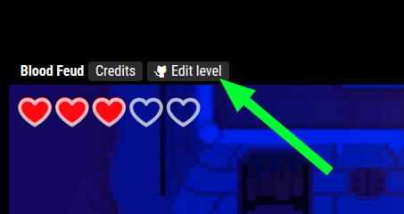

# ❓ FAQ

## Can my level be monetized?

Yes, eventually.

## Will there be multiplayer?

No. Get Lost is a single player experience and is not a good fit for multiplayer.

## Can you add web3/crypto/NFTs?

No. There is no place for crypto in Get Lost.

## Can I make a shooter/platformer/puzzler/etc in Get Lost?

The engine is flexible but opinionated. You can make levels with different mechanics, but it's mostly for you to tell stories and provide experiences around exploration and secrets.

## Can I make a level with AI?

You can try, but you probably won't get very far. Making a level requires you to have spatial and visual skills to lay out tiles and setup sensors. Beyond that, authenticity is king. Players want experiences that are hand-crafted and unique.

## Is Get Lost safe/secure?

Read about the security [here.](./reference/security.md)

## How do I make a level?

Currently the absolute best way to learn to make a level is to learn from an existing level. If you see a level you like, click "Edit level", fork the Github repo, and start playing around with it.

