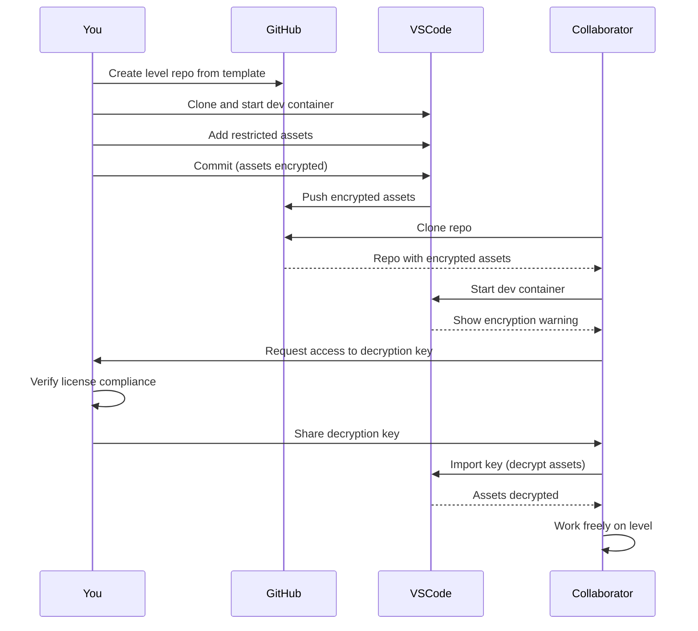
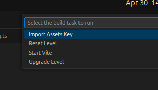

# ✨ Asset management

The Get Lost development environment has a powerful system for managing restricted assets (music, sfx, sprites, tilesets) that have license limitations. Restricted asssets cannot be redistributed outside of the project for which they were purchased, and so they must be handled with care to ensure that you stay in compliance with the artist's license terms.

!!! info

    We use the term "restricted assets" to refer to assets with a "no redistribution" clause, meaning they cannot be uploaded as-is to a public Github repository, as that would be redistributing them.

!!! tip

    If you're using only using assets licensed under Public Domain, or the Creative Commons licenses CC0 or CC-BY, you can ignore this page. These assets can be shared on a public Github repo without any additional processing.

## 🎯 The goal

The purpose of the asset management system is to reconcile the following requirements:

1. Your level must comply with the licenses of your restricted assets by not letting them be redistributed.
1. You must be able to host your level publicly on Github to maximize collaboration.

## ✅ The solution

The solution is to protect the restricted assets with encryption, and only let the encrypted assets be uploaded publicly. We use an industry-standard tool, [`git-crypt`](https://github.com/AGWA/git-crypt) to accomplish this. The Get Lost development environment is set up so that assets put into a specific folder are automatically encrypted with `git-crypt` when they are committed to the repository, and automatically decrypted when you clone the repository (provided you have the decryption key).

This solution gives you a relatively seamless experience when handling the assets: you only need to put them in the correct folder, and they are handled securely.

## 🔀 The workflow

A typical workflow for a new project with collaborators would look like this:

1. You create a public Github repo for your level from the [Get Lost level template.](https://github.com/amoffat/getlost-level-template)
1. You clone the repo locally and start a VSCode dev container.
1. You add your restricted assets to the special `level/art/restricted/` folder.
1. You commit the assets, which automatically encrypts them.
1. You push the encrypted assets to the public Github repo.
1. Your collaborator clones the level repo from Github.
1. When their local dev container starts, they get a message that the repo contains encrypted assets.
1. They reach out to you, the owner, for access to the assets key to decrypt the assets.
1. After verifying that they are in compliance with the assets' license(s), you share the decryption key with them.
1. They import the key into their local repo, decrypting the assets in the `level/art/restricted/` folder.
1. They now have a fully-decrypted repo, and can work on the level without limitation.

!!! warning

    It's important to verify that each collaborator is in compliance with the licenses of your restricted assets. Failure to do could be a breach of your license agreement with the artist, causing your level to be flagged and possibly resulting in legal action from the artist against you. Please consult with a lawyer if you have questions or concerns.

## How-to

### Import the assets key

If you are joining an existing level project, the assets are already encrypted, and you need to import assets encryption key in order to unlock them. Get this key from the repository owner by reaching out to them. Once you have it, press ++ctrl+shift+b++ to bring up the VSCode tasks. Then select `Import assets key`:

Paste your key into the window that pops up, then hit ++enter++. A message should display in the terminal indicating that the decryption was successful.

### Share the assets key

When you first create your level repo and start up the development environment, you should see an untracked, ignored file, `assets.key`, created at the root of your folder. This file contains the base64-encoded symmetric key that will be used to encrypt restricted assets. Share this file, or its contents, directly with your collaborators.

!!! warning

    If you lose this file, your assets will be permanently encrypted and unrecoverable. It's a good idea to save your generated `assets.key` file in your password manager, so this doesn't happen.
