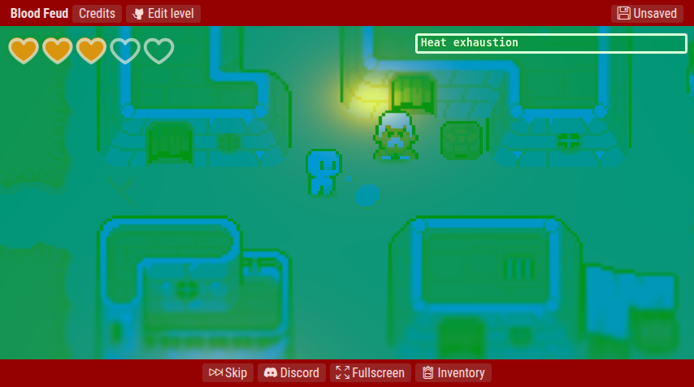

# 🛡️ Security

Get Lost is an open game that anybody can contribute to. As such, there are security considerations around UGC (user-generated content), in particular, untrusted code. We wouldn't want untrusted level code to phish passwords from players by pretending to be another site.

The tl;dr about level code is this:

- It compiles to WebAssembly which can only execute allowlisted functions
- It resides in 2 layers of browser-enforced sandboxing (WASM vm and sandboxed iframe)
- Strict CSP (Content Security Policy) on all pages locks down functionality
- Level code changes can only be made from a public Github repository

No technology is perfect, and there are likely still flaws, but this setup should reduce the number of possible attacks significantly.

!!! warning

    If you are a 1337 h4x0r and you do discover what you believe to be a security flaw in Get Lost, please report it by opening an issue [here](https://github.com/amoffat/getlost-level-template/issues). If the flaw is egregious enough, we'll include your name in the game's credits.

## The level code

Level code is written in [Assemblyscript](https://www.assemblyscript.org/), which compiles to [WebAssembly (WASM)](https://webassembly.org/). WASM code runs in a sandboxed virtual machine, in our case, a VM provided by the web browser. By default, WASM code cannot do much: it can't interact with the outside world through network calls, it can't manipulate the DOM, and it can't manipulate browser apis like storage. It can really only crunch numbers within a block of memory allocated to it.

In order for WASM to do actual useful things, it is allowed to execute functions linked to it. If I want WASM to be able to show an alert, I must deliberately link the alert function to the WASM binary when it is instantiated.

!!! note

    Technically, even if an alert function was linked to the WASM binary, it still wouldn't work because of the engine iframe sandbox, which restricts `alert`. See [engine sandbox](#the-engine-sandbox) below.

This makes the attack surface very small by default.

### DoS attacks

In theory a malicious level could create an infinite loop so the WASM vm never yields control back to the javascript host. This would be annoying for players. However, in practice, because the engine iframe is sandboxed, it runs in a different UI thread, meaning the player can still "skip" to the next level if the holding the current level hangs indefinitely.

## The engine sandbox

If arbitrary level code was able to break out of WASM vm and into the containing frame, it would find itself in another sandbox. The engine that loads the level is itself within a [sanboxed iframe](https://developer.mozilla.org/en-US/docs/Web/HTML/Reference/Elements/iframe#sandbox) with only `allow-scripts` set.

This sandboxed iframe receives no user input events and is displayed underneath an outer UI, which is not controlled by the iframe. The iframe is 🟩, the outer chrome is 🟥. The sandboxed iframe can only control what you see in green.

The sandboxed iframe imposes the several restrictions at the browser level, including:

### Navigation

- Cannot navigate the top-level window (e.g., `window.top.location = '...'`)
- Cannot use `window.open()` to open new windows
- Cannot submit forms targeting the top-level frame

### Top-level scripting access

- Cannot access or manipulate the parent or other frames (`window.parent`, `window.top`)

### Same-origin privileges

- Treated as a unique origin (even if src is same-origin), so:
- Cannot read/write cookies
- Cannot use `localStorage`, `sessionStorage`
- Cannot access IndexedDB
- `document.domain` is ignored

### Plugins and APIs

- No access to `<form>` submissions
- No popups or modal dialogs (`alert`, `prompt`, `confirm`)
- No automatic features like autoplaying audio/video
- No pointer lock, fullscreen, or screen orientation APIs
- No access to clipboard, geolocation, camera/mic, etc.
