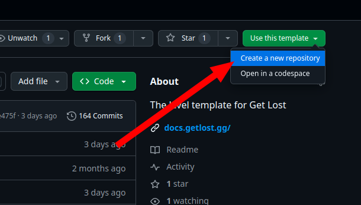
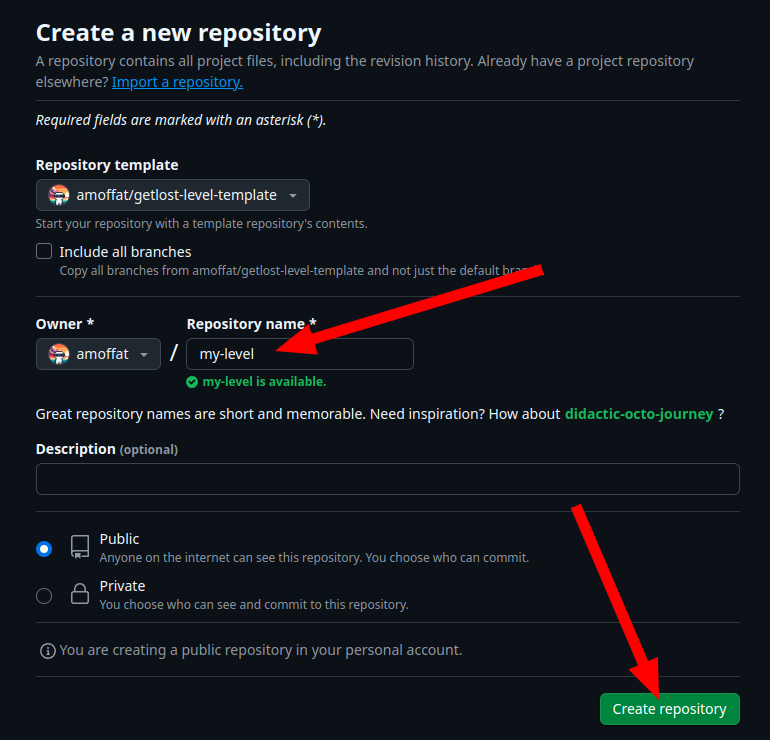
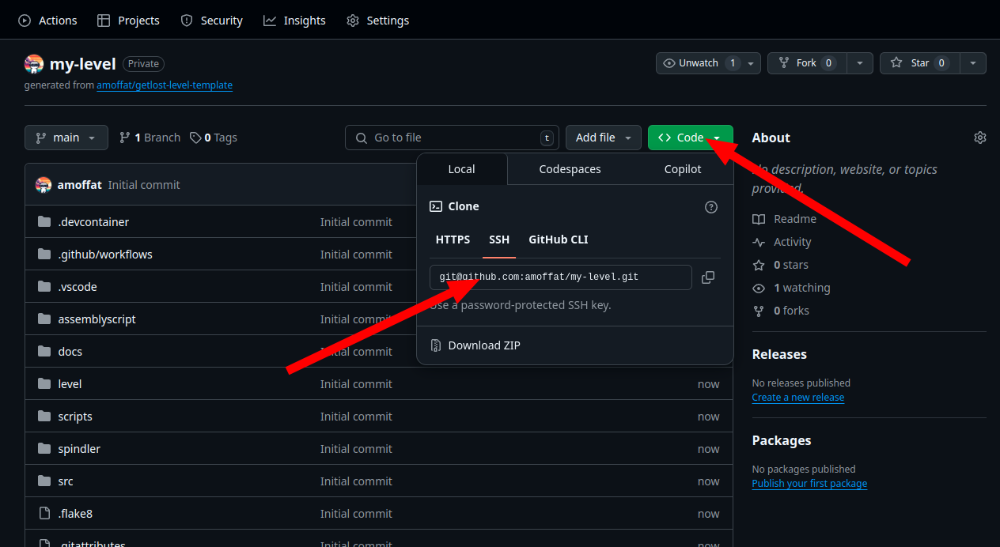
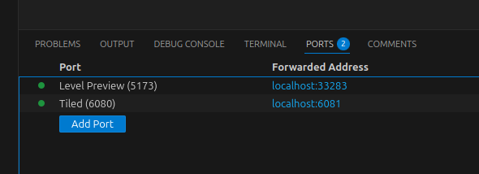
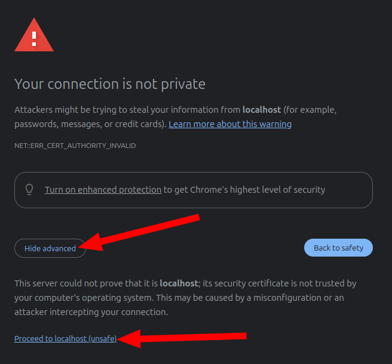

# 💻 Starting development

Get Lost gives you a level template that you can (and should) use to start building levels quickly. It comes with a premade demo map, some sample level code, and public domain assets.

There are 2 ways to use the level template:

- Using Github Codespaces
- Running it locally in a VSCode devcontainer

## Using Github Codespaces

!!! info "Difficulty: easy"

This is the recommeded way for beginners to use the Get Lost level template. You don't need anything installed on your computer... just a web browser and a Github account. Github Codespaces is a way to launch VSCode (and other programs) in the browser, so you can do all of your work in the browser without installing anything locally.

!!! note

    This method is easiest for beginners, but it's pretty limited for more seasoned
    developers. If that's you, try the [Local Devcontainer](#local-devcontainer) method instead. You'll get all the benefits of a containerized dev environment, with a much snappier experience.

To get started, [open the level template repo](https://github.com/amoffat/getlost-level-template) and follow the instructions in the README.

### 🚨 Troubleshooting

#### The codespace takes forever to boot.

If you're not in US-East or US-West, this issue is likely caused by the prebuild cache not being available in your region. The codespace prebuild cache is something that I have to turn on manually per-region, and it accelerates the startup time, at a small cost to me. If you wait long enough, the codespace will boot. However, you can request your region be enabled in our [Discord](https://discord.gg/v4AAezkSEu).

## Local Devcontainer

!!! info "Difficulty: medium"

First go to the [level template repo](https://github.com/amoffat/getlost-level-template) and click `Use this template`, then `Create a new repository`:

Name your new repo whatever you want:

Once your new repo is created, clone it locally. We assume you know how to do this!

After you've cloned the repo locally, open it in VSCode. You should get a popup in the bottom right as VSCode detects that the repo has a devcontainer. When you see it, click `Reopen in Container`:

!!! note

    If you're on WSL2 for Windows, you'll need to make sure that you've activated the WSL integration in Docker Desktop. See [this](https://docs.docker.com/go/wsl2/) for more info.

Now navigate to the `Ports` tab in VSCode and you should see two open ports. One is for playtesting your level (Level Preview) and the other is for using the map editor (Tiled):

### 🚨 Troubleshooting

#### My level preview won't open

If you click the `Open in browser` button on the `Level Preview` port and your browser hangs, check that it is opening as `https://` and not `http://`. We serve the level preview over https on localhost, which is a little non-standard, but required for how we load assets.

Your browser also might display an "unsafe site" warning. This is because it's hosted as https on localhost, using a self-signed certificate, so the browser has no way of verifying it. There should be an option to proceed anyways and ignore the warning.

