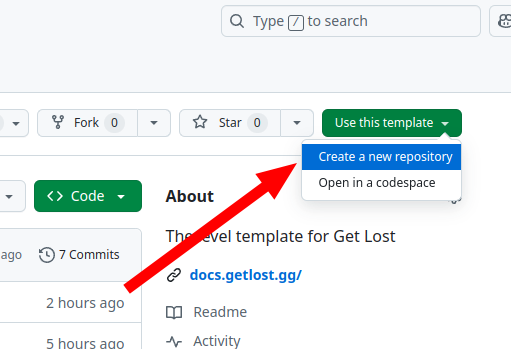
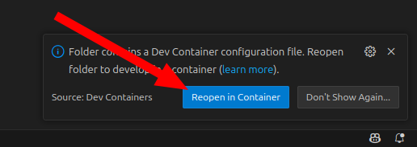

# 💻 Starting development

Get Lost gives you a level template that you can (and should) use to start building levels quickly. It comes with a premade demo map, some sample level code, and public domain assets.

There are 3 ways to use the level template, from beginner to advanced:

- Using Github Codespaces
- Running it locally in a VSCode devcontainer
- Running it locally outside of a devcontainer

## Using Github Codespaces

!!! info "Difficulty: easy"

This is the recommeded way for beginners to use the Get Lost level template. You don't need anything installed on your computer... just a web browser and a Github account. Github Codespaces is a way to launch VSCode (and other programs) in the browser, so you can do all of your work in the browser without installing anything locally.

!!! note

    This method is easiest for beginners, but it's pretty limited for more seasoned
    developers. If that's you, try the [Local Devcontainer](#local-devcontainer) method instead.

To get started, [open the level template repo](https://github.com/amoffat/getlost-level-template) and follow the instructions in the README.

### 🚨 Troubleshooting

#### The codespace takes forever to boot.

If you're not in US-East or US-West, this issue is likely caused by the prebuild cache not being available in your region. The codespace prebuild cache is something that I have to turn on manually per-region, and it accelerates the startup time, at a small cost to me. If you wait long enough, the codespace will boot. However, you can request your region be enabled in our [Discord](https://discord.gg/v4AAezkSEu).

## Local Devcontainer

!!! info "Difficulty: medium"

First [create a new repo](https://github.com/amoffat/getlost-level-template) from the level template. Then clone the repo locally as normal.(1)
{ .annotate }

1. We assume you know how to do this!

Open your locally-cloned repo in VSCode. You should get a popup in the bottom right as VSCode detects that the repo has a devcontainer. When you see it, click `Reopen in Container`:

Now navigate to the `Ports` tab in VSCode and you should see two open ports. One is for playtesting your level (Level Preview) and the other is for using the map editor (Tiled):

### 🚨 Troubleshooting

#### My level preview won't open

If you click the `Open in browser` button on the `Level Preview` port and your browser hangs, check that it is opening as `https://` and not `http://`.

## Bare-metal installation

!!! info "Difficulty: medium"

This is the most advanced installation process because you need to manage the dependencies yourself. There aren't really too many advantages of this method over the local devcontainer.

TODO
