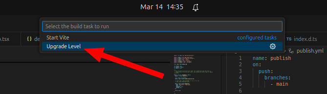
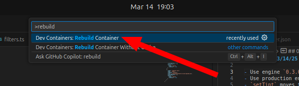

# ⏫️ Upgrading your level

Upgrading your level is a key part of level development. It's how you stay up to date with the latest changes and features.

!!! note "Do you just want to run the upgrade? Go [here](#running-the-upgrade)."

## How engine versioning works

When you create a level from the level template, your level is "soft pinned" (1) to a particular version of the engine. You can find this pinned version by looking in the `/engine_version.txt` file of your repo. This engine version is used by the development environment to know which engine to load.
{ .annotate }

1. In software development, version pinning is telling the software to only use a specific version of some dependency. This makes the software predictable and less prone to breaking because it will never accidentally use a different version.

Pinning your level to a specific version of the engine means you don't have to worry about changes to the engine breaking your level. You can build it once and forget it, and Get Lost will continue to add features, fix bugs, and it **shouldn't** impact the playability of your level at all.

!!! bug

    Versioning systems are tricky to operate and sometimes bug patches might need to be backported to older versions, which can affect the playability of those levels, even if version pinning is implemented.

### Serving the correct version

On the backend, the Get Lost platform controls what version of the engine it will actually serve for a given requested version. For example, if `/engine_version.txt` contains `1.2.3`, the platform might actually serve the engine at version `1.4.0`, if that is determined to be the best version.

Get Lost uses the [semantic versioning](https://en.wikipedia.org/wiki/Software_versioning#Semantic_versioning) scheme to determine how versions are compatible with one another, but generally speaking, all major versions are forward compatible. This means that `1.2.7`, `1.4.0`, `1.9.3` are all compatible upgrades from `1.2.3` because the major version is the same. However, `2.1.0` isn't, because the major version changed.

## Running the upgrade

Upgrading your level involves running an upgrade script that already lives in your level's repo. This script will automatically copy the `/level` directory to a safe place, then sync the rest of the code with the latest level template, then put the `/level` directory back. Finally, it will commit the changes.

There are 2 ways to run this upgrade script:

### From VSCode

Whether you're developing in a hosted development environment on Github Codespaces, in a local devcontainer, or on the bare metal, as long as you're running VSCode, you should be able to do the following:

Press ++ctrl+shift+b++ to open the command palette for build tasks. Then select `Upgrade Level`.



Once the script completes, you're done!

### From the commandline

You can achieve the same result as above by running the upgrade script from the commandline.
Open a terminal and navigate to your level's repo. Then run:

```py
python3 scripts/upgrade.py
```

Once the script completes, you're done!

## Troubleshooting

!!! tip

    If nothing else works, you can always re-create your level repo and save all of the work in your `/level` folder:

    1. Copy out your `/level` folder.
    1. Re-create your level repo manually.
    1. Copy `/level` with your copied level folder.

### My devcontainer is acting strange

Sometimes the upgrade script will replace files in `/.devcontainer/` which are used by your development environment. VSCode will usually detect these changes ask if you want to rebuild the container. You'll want to do this, so that your devcontainer is running as intended.

Open the command palette with ++ctrl+shift+p++, then type `Rebuild container` and select `Dev Containers: Rebuild Container`



The devcontainer will rebuild, and everything should be in a pristine state.

### I lost my Assemblyscript code changes
