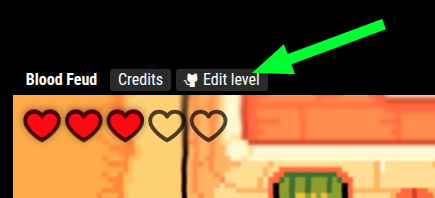

# Learning from level code

The best way to learn how to build a level in Get Lost is to look at an existing level's code.

Each level has an `Edit level` button in the upper left that will take you to the public Github repo for the level.

Once there, you can explore the `level/` folder to see all of the assets that make the level.

`level/code/main.ts` in particular contains the main level code.
