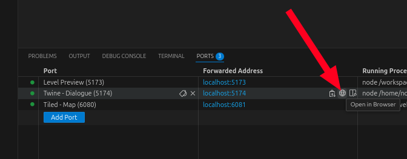
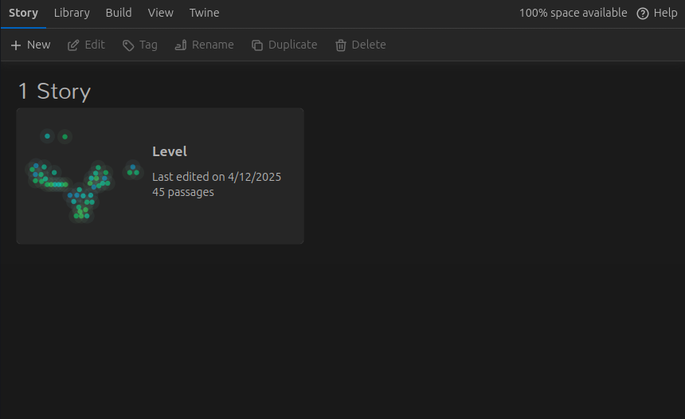
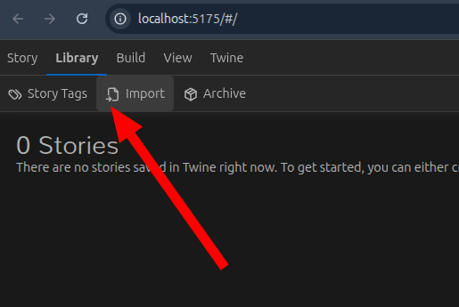
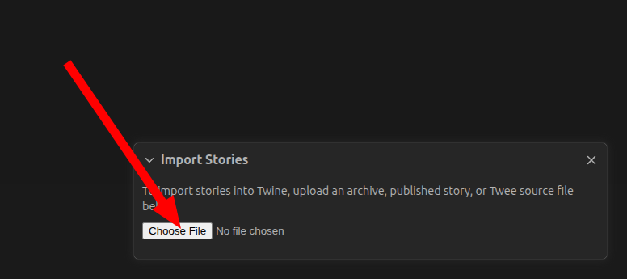
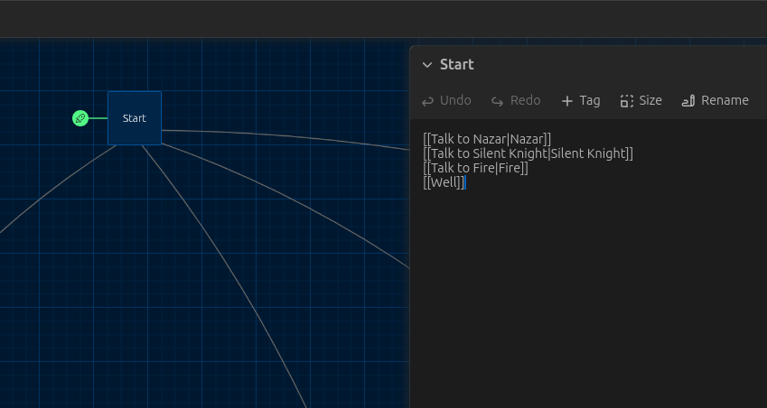
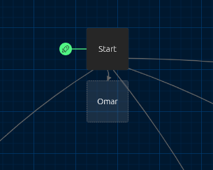
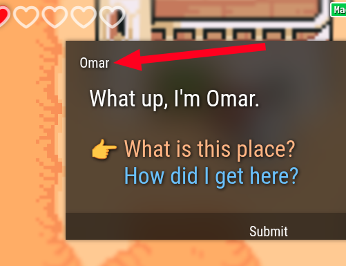
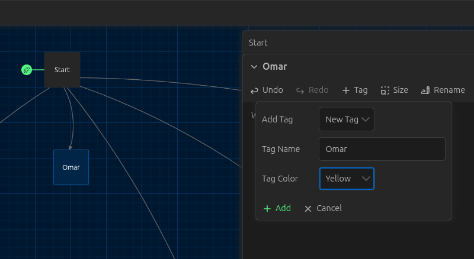
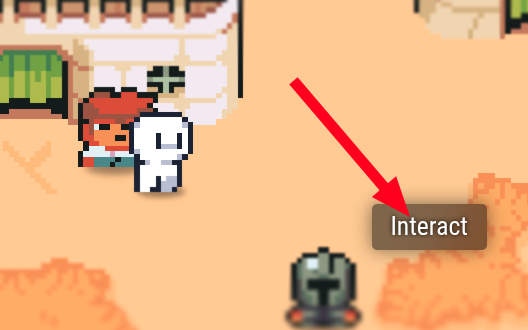

# 💬 Creating dialogue

Dialogue is an important aspect of your Get Lost level. Through dialogue, you can reveal parts of your story that are difficult to tell visually. Get Lost dialogue can be dynamic, changing with time of day, items that the player has, or choices that they've made.

!!! info

    Looking for the SugarCube reference? [Go here.](../../reference/dialogue/sugarcube.md)

We use [Twine](https://twinery.org/) to create dialogue, and it comes builtin to the Get Lost development environment. This means you don't need to install anything.

In this tutorial, we'll add dialogue for a new NPC named Omar.


## 🚀 Fire up Twine

Go to your `Ports` tab in VSCode and open the `Twine - Dialogue` port in the browser. This will launch the Twine software.



Once your browser tab opens, you should see the Twine interface. You'll see an existing story named "Level", like the following:



Double-click on the story to open it for editing.

If you don't see the default story, you might need to import it from your level files first. Go to `Library` then `Import`:



Click `Choose File` then select your story file from `<your level dir>/level/story/Level.twee`



## 🆕 Add a new passage

Since our Omar NPC will be totally new, there are no existing passages(1) to attach to, so we need to create some new nodes. Start by finding the `Start` passage(2) and double clicking it to open it.
{ .annotate }

1. A passage is what Twine calls a dialogue node in the story.
2. The start passage has a little green spaceship attached to it. 🚀



Now add a link for Omar by adding the following line: `[[Talk to Omar|Omar]]`. Once you've done that, a new passage automatically appears in the workspace:



## 🗪 Add new dialogue

The new Omar passage has no content, which is why it has a dashed border. Double click it so we can add some content. The content that we'll add will be what Omar says when we interact with him. Write anything you want.


We also want all conversations with Omar have the title "Omar" at the top(1). We can do this by putting a tag on this passage. Click the "+ Tag" button, then select "New Tag", set "Tag name" to "Omar" and optionally set a color. Then click "+ Add".
{.annotate}

1. 



This will make it so that the all interactions with Omar have the title "Omar" when you're playing the game.

!!! note

    You only need to set a tag on the very first passage for the NPC. This tag will be automatically inherited by all of the passages underneath it.

## 🤔 Add dialogue choices

Now that we have a text interaction with Omar, let's add some choices. Add the following lines to your passage:

```
[[What is this place?]]
[[How did I get here?]]
```

When you add this text to your passage, Twine will automatically create 2 new connected passages.


Now repeat the process with the new passages&mdash;write new dialogue, then create new responses with links.

## 🧩 Add logic

Twine nodes support a basic programming language(1). It's not as powerful as a real programming language, like Javascript or Python, but most of the time it's enough to do what you want. It's called [`SugarCube.`](../../reference/dialogue/sugarcube.md)
{ .annotate }

1. We call it a programming language, but Twine calls it a "story format." Twine has several story formats, and they're all effectively different languages, but SugarCube is the only one we support.

Let's add some logic that will display a different message if the user has talked with Omar already. Change your Omar dialogue to have the following contents:

```
<<if visited() > 1>>
  Welcome back.
<<else>>
  What up, I'm Omar.
<</if>>

[[What is this place?]]
[[How did I get here?]]
```

Now, if it's the first time the player has interacted with Omar, they'll be presented with:

```
What up, I'm Omar.

[[What is this place?]]
[[How did I get here?]]
```

And every time afterwards, they'll be presented with:

```
Welcome back.

[[What is this place?]]
[[How did I get here?]]
```

!!! info

    You're not just limited to putting text within `<<if>>` and `<<else>>`; you can put links as well.

SugarCube is a powerful markup language. You can set variables, call functions, and trigger events. For the full reference of what Get Lost supports, [go here.](../../reference/dialogue/sugarcube.md)

## ✅ Trigger your dialogue

Now that we have a basic interaction, we need to tell your level code how to fire off that interaction. There are two ways to do this.

1. Force the dialogue when the player touches a sensor.
1. Show an "Interact" button when the player touches a sensor, then show the dialogue when they press that button.

### 👀 Forcing the dialogue

This option is good for mandatory dialogue that the player must see. To do this, open `level/code/main.ts` and find the `sensorEvent` handler. It should look something like this:

```typescript
export function sensorEvent(
  initiator: string,
  sensorName: string,
  entered: bool
): void {
  if (initiator !== "player") {
    return;
  }
  if (sensorName === "flame") {
    dialogue.stage_Fire(entered);
  } else if (sensorName === "knight") {
    dialogue.stage_Knight(entered);
  } else if (sensorName === "well") {
    dialogue.stage_Well(entered);
  } else if (sensorName === "nazar") {
    dialogue.stage_Nazar(entered);
  } else if (sensorName === "water") {
    inWater = entered;
  }
  // ...
}
```

We add a new `else if` section for a new sensor:

```typescript
else if (sensorName === "omar") {
    dialogue.passage_Omar();
}
```

This will make it so that when the player enters the sensor(1) named `omar`, your dialogue for Omar will be displayed. However, the player won't have a choice in seeing the dialogue, so if that's what you want, read on.
{.annotate}

1. You'll still need to set up the sensor in the Tiled map editor, either by creating a new sensor object, or by adding an NPC and naming it `omar`.

### 👉 Staging the dialogue

Use this option if you want to give the player freedom about when the dialogue is displayed. The code looks basically the same as forcing dialogue, except we use `dialogue.stage_Omar(entered)` instead of `dialogue.passage_Omar()`. What this does is it gives the player an `Interact` button when they enter the sensor. When they click the button, the `buttonPressEvent` fires, and `dialogue.dispatch(passageId)` is called to show your Omar passage.



## 🕹️ Play your changes

Each time you make a change in Twine, it autosaves and reloads the level preview. The typical workflow involves going back and forth between the level preview tab and the twine tab, making changes, then trying those changes.

!!! info

    Unfortunately, each time the level preview reloads, the whole level is reset, so you have to play through your dialogue from the beginning.

## 🛠️ Debug your dialogue

Get Lost automatically transpiles(1) your Twine dialogue into an Assemblyscript file that lives in `level/code/generated/dialogue.ts`. Feel free to look at the generated code to see what it's doing.
{.annotate}

1. Transpiling is converting from one source code to another. In this case, we're converting from a Twine `.twee` file to AssemblyScript.

!!! warning

    Any changes that you make to the generated dialogue file will be overwritten when the file is regenerated. It is not designed to be edited.
