# 📐 Building a map

This tutorial will guide you through creating a basic Get Lost map in the [Tiled map editor.](https://www.mapeditor.org/) Tiled is a free and open source 2d map editor that can support many game engines, including Get Lost's custom engine. Most of your level design work will take place in Tiled.

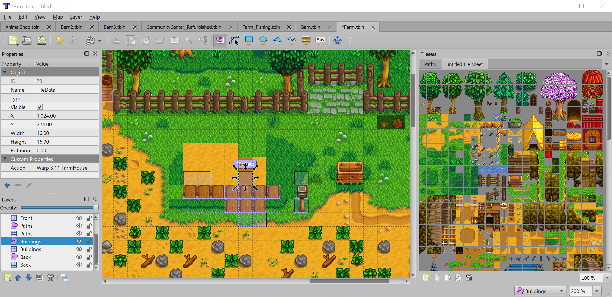

## Download Tiled

The Tiled map editor is available [on itch.io.](https://thorbjorn.itch.io/tiled) Download and install it.

## Create your project folder

Somewhere on your harddrive, create a folder that will contain everything for your level. We'll call this folder `test-level` but you can call it whatever you want. Inside the `test-level` folder that you just created, create the following folders: `tiled`, `art`, `sounds`, and `code`. So now your folder structure should look like this:

```
test-level/
    tiled/
    art/
    sounds/
    code/
```

## Gather your art assets

Before you can start building a map, you should collect some of the basic art assets that you want to use in the map. We'll put these assets in the different folders that we created in the previous step.

### Tilesets

You'll need a tileset to use. We'll use the free Pixel Plains tileset available [here.](https://snowhex.itch.io/pixel-plains)

[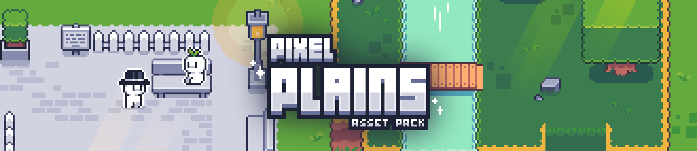](https://snowhex.itch.io/pixel-plains)

Go ahead and download the free version and extract the assets to the `art/` folder in your project folder.

## Create the map

Now that you have your art assets in place, you're ready to create a new project in Tiled. Open Tiled, click "New Project", and save the project in the `tiled/` folder of your project folder.

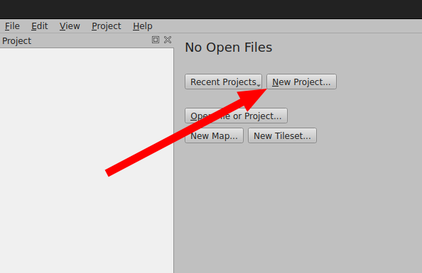

Now click "New Map":

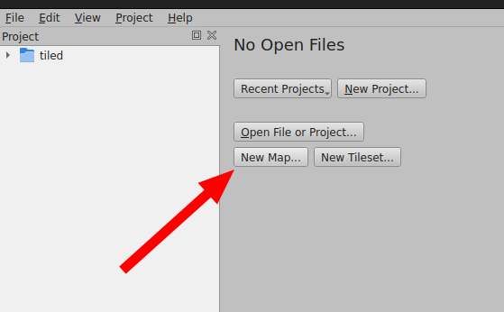

When the map settings open, change the Map Size to "Infinite" and the "Tile Size" to 16px by 16px:

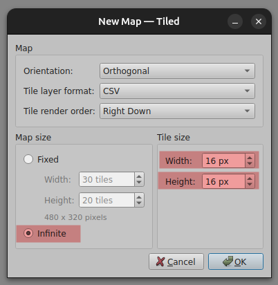

Then save the map with `ctrl+s` and save it in your `tiled/` folder as a "JSON Map Files"

!!! warning

    You must save your map as a `.tmj` file, *not* a `.tmx` file. Get Lost only understands `.tmj`

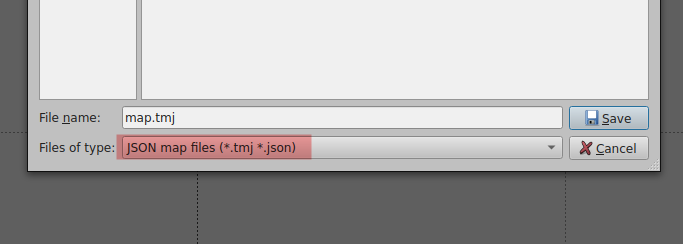

## Add your tileset

Let's add the Pixel Plains tileset that you put into `art/` to our project, so that we can place tiles into the map.

First, click "New Tileset":

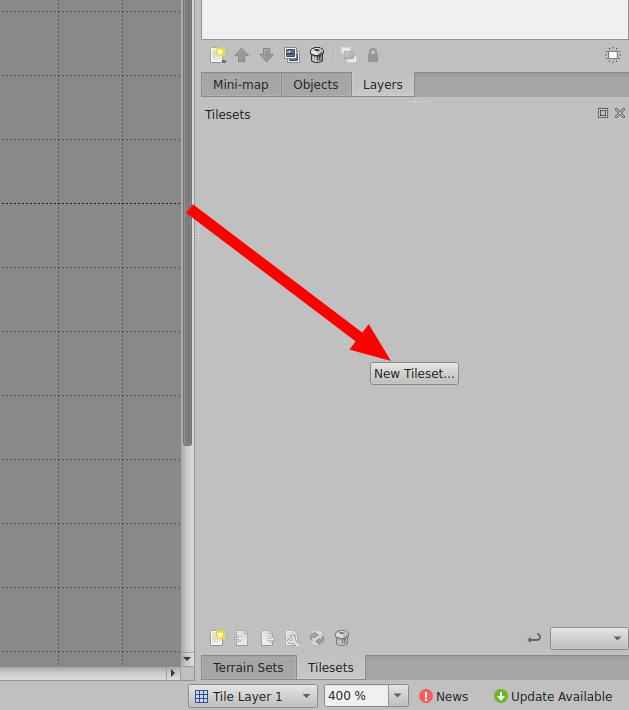

Then browse to your tileset (in the `art/` folder) and select it. Make sure that the tile size is 16px by 16px:

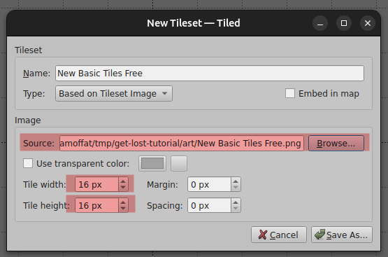

Click "Save as" to save your tileset file. Save it in `tiled/` folder, and make sure to save it as a `.tsj` file.

!!! warning

    You must save your tileset as a `.tsj` file, *not* a `.tsx` file. Get Lost only understands `.tsj`

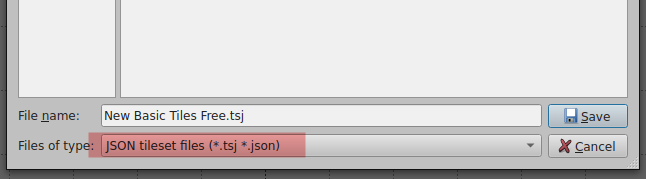

Once you save your tileset file, you'll be brought back to the main Tiled interface, but on the tab for your tileset. Switch from the tileset tab back to your map tab:

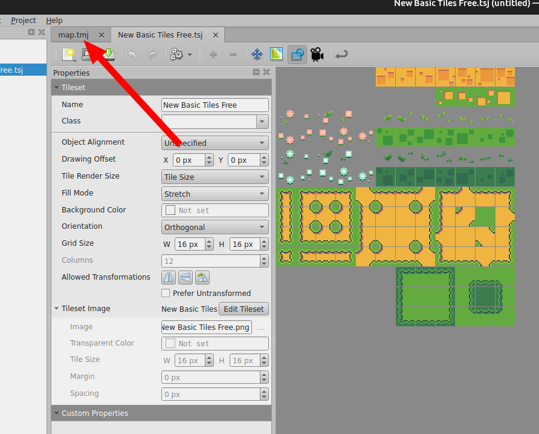

Now you can use the tile stamp tool to place tiles in your map:

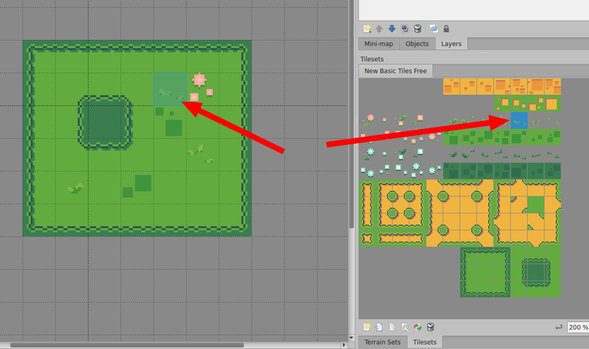

<!-- ## Import Get Lost metadata

Get Lost uses custom types that Tiled needs to know about. This will let you annotate different parts of your map so that the Get Lost engine knows to treat it differently. For example, with the custom type metadata, you can make a normal sprite into an item that can be picked up by the player.

First, download the current custom types [here TODO](TODO)

Then open the View -> Custom Types Editor:

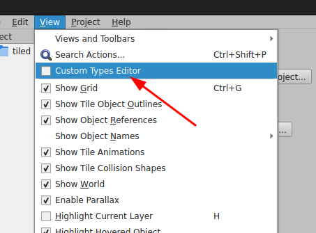

Click Import, then select the file that you downloaded:

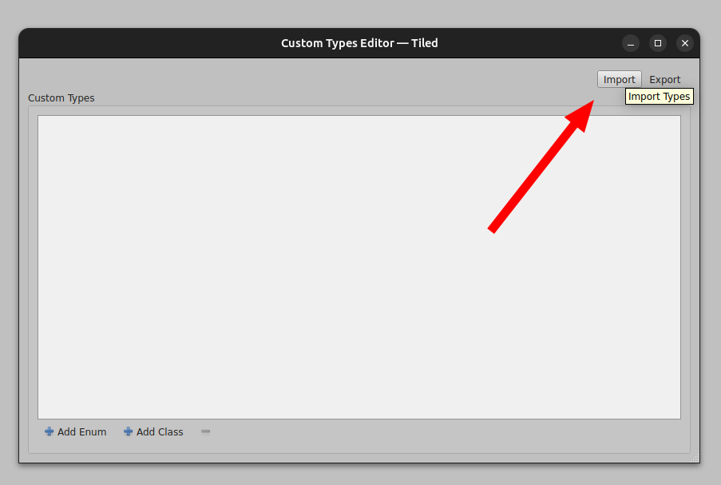 -->

## Next steps

You're going to want to become familar with the basics of the Tiled map editor, which is outside of the scope of this tutorial. The best resource for this is the [Tiled documentation](https://doc.mapeditor.org/en/stable/). There are also some good videos on Youtube. The following Youtube playlist is a little old, but covers the basics pretty well:

<iframe width="560" height="315" src="https://www.youtube.com/embed/videoseries?list=PL6wuv1YGOTFfxi8pdN2ghWmDqZqy3_XA7" frameborder="0" allowfullscreen></iframe>

After that, you'll be ready to look at the other map tutorials in the Lost Docs.
