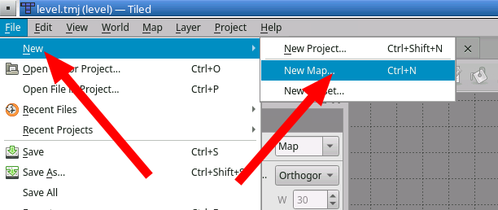

# 🔄 Resetting the map

If you don't like the default map from the level template, you can reset it.

With your project open in Tiled, create a new map.

Now pick the following settings for your map:

!!! note "Feel free to change the tile size if you know what tiles you want to use."

Once the new map opens, save it, and save over the old `level.tmj`.
