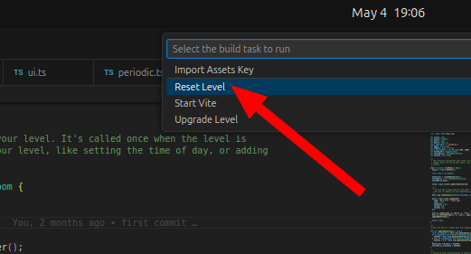

# 🔄 Resetting the map

If you know what you're doing, you don't need to use the default map from the level template. To reset your level, go to your VSCode editor and press ++ctrl+shift+b++ to open tasks, then select `Reset Level`.

!!! warning

    Resetting your level will delete your art assets. Reset only when you are sure you want to start with a blank slate.

This will completely erase all of your art assets (tilesets, images, sounds), as well as reset your Tiled level map. It will also create some of the basic layers in the Tiled map.

!!! note

    It currently doesn't reset your Twine dialogue or any of your level code. You'll need to reset that yourself.
